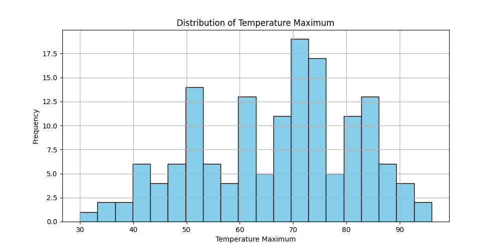
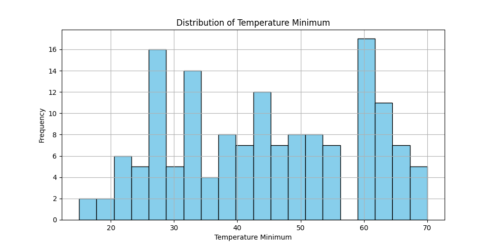
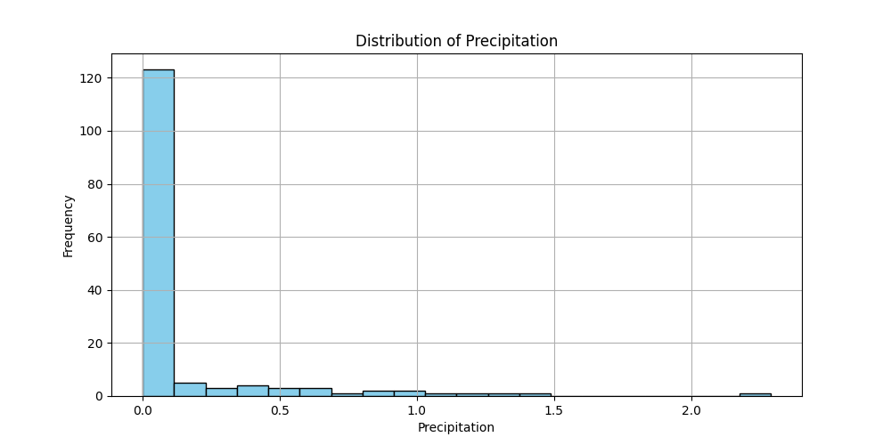

# Summary Report

## Descriptive Statistics

|         |   Temperature Minimum |   Temperature Maximum |   Precipitation |   Snowfall |   Snow Depth |   Avgerage Wind Speed |
|:--------|----------------------:|----------------------:|----------------:|-----------:|-------------:|----------------------:|
| mean    |               44.2252 |               66.9669 |        0.12702  |  0.0177483 |    0.0331126 |               7.0102  |
| median  |               45      |               70      |        0        |  0         |    0         |               6.7     |
| std_dev |               14.5388 |               14.7193 |        0.327184 |  0.140917  |    0.242685  |               3.17123 |

